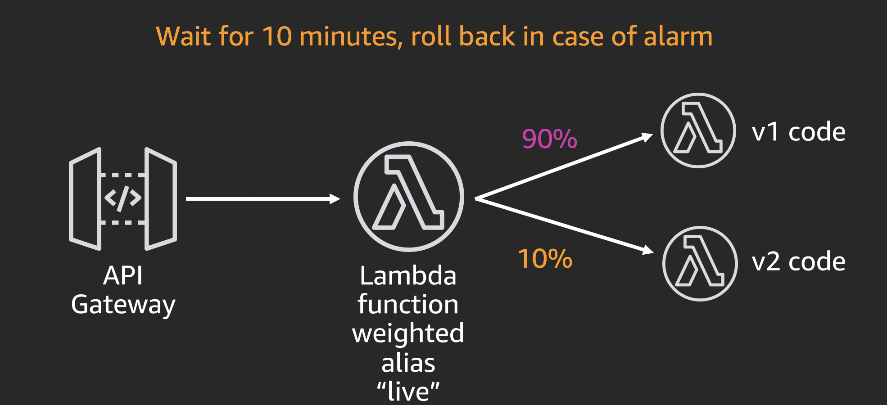
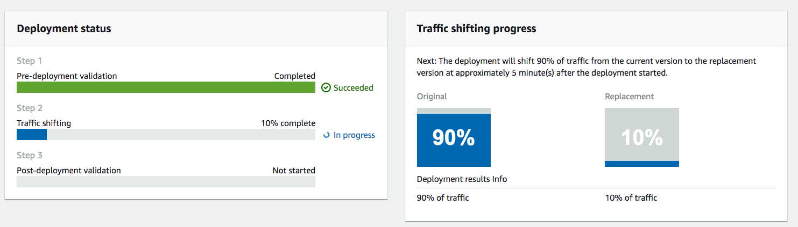
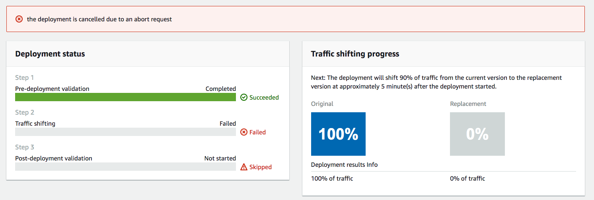

# serverless-canary-deployment
Demo on using CodeDeploy to implement canary deployments in lambda

Table of Contents

* [Overview](#overview)

* [Introduction](#intro)

* [Launching a development toolchain using AWS CodeStar](#devtool)

* [Modifying your AWS Lambda Function on AWS Cloud9](#cloud9)

* [Deploying Your Function using AWS SAM and AWS CodeDeploy with a canary deployment](#sam)

* [Adding a CloudWatch Alarm to control the canary deployment](#cloud-watch-alarm)

* [Clean up](#cleanup)

* [Conclusion](#conclusion)

<a name="overview"></a>
# 1. Overview

With services like AWS CodeStar, AWS Cloud9, AWS Lambda and Amazon API Gateway, developers can very easily develop, debug, and deploy serverless applications in the cloud.

AWS CodeStar enables you to quickly develop, build, and deploy applications on AWS. AWS CodeStar provides a unified user interface, enabling you to easily manage your software development activities in one place. With AWS CodeStar, you can set up your entire continuous delivery toolchain in minutes, allowing you to start releasing code faster.

AWS Cloud9 is a cloud-based integrated development environment (IDE) that lets you write, run, and debug your code with just a browser. It includes a code editor, debugger, and terminal. With Cloud9, you can quickly share your development environment with your team, allowing you to pair program and track each other&#39;s inputs in real-time.

AWS Lambda lets you run code without provisioning or managing servers. You pay only for the compute time you consume - there is no charge when your code is not running. With Lambda, you can run code for virtually any type of application or backend service - all with zero administration. Just upload your code and Lambda takes care of everything required to run and scale your code with high availability.

In this Lab, you will experience:

- Launching development tools for building a serverless application using AWS CodeStar.
- Developing your first AWS Lambda function.
- Deploying your first AWS Lambda function using AWS SAM (Serverless Application Model).
- Improving the validation of the canary deployment using a CloudWatch alarm.

<a name="intro"></a>
# 2. Introduction

In this hands-on lab, we are going to start with a Hello World Python web service that returns a static JSON payload. As part of this lab, we will be developing and deploying some modifications to the function and we will next proceed to extend our deployment mechanism (based on canary deployment) to include a CloudWatch alarm that will act as a safety net to ensure we do not deploy an incorrect implementation (from the performance perspective). The high level architecture is as follows:

  

<a name="devtool"></a>
# 3. Launching a development toolchain using AWS CodeStar

1. Sign into the AWS Management Console [https://console.aws.amazon.com/](https://console.aws.amazon.com/).

2. In the upper-right corner of the AWS Management Console, confirm you are in the desired AWS region (e.g., N. Virginia).

3. Click on **AWS CodeStar** from the list of all services.

4. Click on **Start a project**.

5. If this is the first time you use the service, you will be prompted to create the required service roles for AWS Code \* services. Select **Yes, create role**.

6. Choose a project template:
- Under _Application Category_ select _Web Service_
- Under _Programming Languages_ select _Python_
- Pick _Python Web Service AWS Lambda (running serverless)._

7. Enter the project details:
- Project name: _canary-lab_
- Which repository do you want to use? _AWS CodeCommit._
- Click **Next**.

8. Leave everything as the default and click on **Create Project**. If this is the first time you use the service, you will also be prompted to enter your display name and email.

9. We are going to use AWS Cloud9 as our IDE. Select AWS Cloud9 and hit **Next.**

10. For our instance, we will select _t2.micro_. We will leave the networking settings as default which will launch the instance in our default VPC in a public subnet. Under _Cost-saving_ settings, observe that the environment will be automatically shut down after 30 minutes. Click **Next**.

11. AWS CodeStar is now provisioning all the AWS Code \* services. This process may take around 3-5 minutes.

12. While you wait, open up a new browser tab and go to the [IAM Roles console](https://console.aws.amazon.com/iam/home?region=us-east-1#/roles) (listed under Services). Search for 'code' and notice that AWS CodeStar created new IAM Roles for each of the AWS service we are going to use.

13. Head back to the _AWS CodeStar Dashboard_ and scroll to the _Application endpoints_ panel.
 
14. Click on the endpoint URL. You should see a &quot;Hello World&quot; JSON document being returned. Congratulations! You successfully configured an end-to-end development and continuous deployment pipeline on AWS.

<a name="cloud9"></a>
# 4. Modifying your AWS Lambda Function on AWS Cloud9

15. Go back to the AWS CodeStar dashboard, and click on **IDE** on the left pane.
Click **Open IDE.**

 
16. Upon first login, AWS Cloud9 automatically clone a starter project "locally" into our development instance. You should see something like this:

```
user:~/environment $ /tmp/git-cloning-runner-xxx-xxx.sh
Cloning into '/home/ec2-user/environment/canary-lab'...
remote: Counting objects: 16, done.
Unpacking objects: 100% (16/16), done.

Navigate to your cloned repository by typing "cd /home/ec2-user/environment/canary-lab" to start working with "https://git-codecommit.us-east-1.amazonaws.com/v1/repos/canary-lab"

To set your display name run "git config --global user.name YOUR_USER_NAME"
To set your display email run "git config --global user.email YOUR_EMAIL_ADDRESS"

user:~/environment $
```

17. We are going to modify the lambda implementing the service to introduce a small change. Open the `index.py` file and modify it as follows (basically, modifying the msg being returned):

```
import json
import datetime


def handler(event, context):
    data = {
        'output': 'Hello World from Madrid',
        'timestamp': datetime.datetime.utcnow().isoformat()
    }
    return {'statusCode': 200,
            'body': json.dumps(data),
            'headers': {'Content-Type': 'application/json'}}
```

18. We are going to add all our pending changes, commit it to Git and push it to our AWS CodeCommit Repository:

```
cd canary-lab
git commit -am "add Madrid to the hello msg"
git push
```

19. Congratulations! You have modified your AWS Lambda function.

<a name="sam"></a>
# 5. Deploying Your Function using AWS SAM and AWS CodeDeploy

20. By default, AWS CodeStar configured AWS CodeDeploy to deploy on every code commits. You can see its progress by going back to your AWS CodeStar canary-lab dashboard where you can see the status of the current deployment.

21. Our CodeStar wizard has configured our lambda function to be deployed using a Canary Deployment strategy where only 10% of the traffic should go to the new version during 5 minutes and then extended to the 100% of the traffic. You can see the details by going back to the Cloud9 environment and opening the `template.yml` file and you will see a section like this:

```
Globals:
  Function:
    AutoPublishAlias: live
    DeploymentPreference:
      Enabled: true
      Type: Canary10Percent5Minutes
      Role: !Ref CodeDeployRole
```

22. To confirm that we are using canary deployment, go back to your AWS CodeStar canary-lab dashboard and see more details about the deployment by selecting **Deploy** from the left hand pane. You will notice that (after the build phase is done) a deployment is taking place. On the CodeDeploy console, select the **Deployments** section and click on the deployment in progress (if you wait over 10 minutes it might be finished!) and you should be able to see the 90% / 10% traffic shiftment status

  
 
23. Additionally, you might want to feel what your customer are currently experimenting when accessing your web service during the canary deployment. Go back to your web service URL (Head back to the _AWS CodeStar Dashboard_ and scroll to the _Application endpoints_ panel.) and refresh it until you see the modified version (the one with _Madrid_ in the response). It might take you several refreshs before you can see the new version (remember the 90/10 distribution!)

<a name="cloud-watch-alarm"></a>
# 6. Adding a Cloud Watch alarm to control the deployment

24. After a successful deployment, we want to improve the canary deployment configuration to include an alarm that will let us know if any new version of the lambda implementation results in an increase in the lambda's execution latency above 1 second. In case the new alarm is triggered, we want to rollback the canary deployment to the previous version to avoid impacting our customer with such unacceptable delay!

25. In order to implement these changes, go back to Cloud9 and edit the `template.yml` file to extend it with the Cloud Watch alarm and the corresponding changes to the canary deployment configuration by extending the _Globals_ section:

```
Globals:
  Function:
    AutoPublishAlias: live
    DeploymentPreference:
      Enabled: true
      Type: Canary10Percent5Minutes
      Role: !Ref CodeDeployRole
      Alarms:
        - !Ref TooSlowAlarm
```

26. Next, in the same `template.yml` file you should add the _TooSlowAlarm_ resource being referenced above. You can refer to [Safe Lambda deployments](https://github.com/awslabs/serverless-application-model/blob/master/docs/safe_lambda_deployments.rst) for some guidance

27. Before we push our changes, we should attach new permissions to the IAM Role being used by CloudFormation to deploy our stack in order to include the ability to add new CloudWatch Alarms (as well as modifying the CodeDeploy configuration). To do so, go to the IAM Console and, under Roles, search for _CodeStarWorker-canary-lab-CloudFormation_ and modify it to Allow the following Actions on every Resource:
- codedeploy:UpdateDeploymentGroup
- cloudwatch:PutMetricAlarm
- cloudwatch:DeleteAlarms

28. Commit our latest changes to AWS CodeCommit again.

```
git commit -am "add CW alarm for canary"
git push
```

29.	Wait for our Continuous Deployment pipeline to complete. Since we have no introduced any aritificial delay in the lambda implementation it should go fine

## Modify your Lambda Function to include an artificial delay

30.	So far so good, we have introduced the CloudWatch alarm that is protecting us from a wrong implementation in terms of performance but ... how can we be sure that it is working? ... Lets try to prove it!

31. Go back to Cloud9 and edit the `index.py` file to modify it as follows to add the delay (2 seconds):

```
import json
import datetime
import time

def handler(event, context):
    print("Going to sleep ...")
    time.sleep(2)
    print("Back to live ...")

    data = {
        'output': 'Hello World from Madrid (with some delay)',
        'timestamp': datetime.datetime.utcnow().isoformat()
    }
    return {'statusCode': 200,
            'body': json.dumps(data),
            'headers': {'Content-Type': 'application/json'}}
```

32. Commit our latest changes to AWS CodeCommit again.

```
git commit -am "add artificial delay"
git push
```

33.	Wait for our Continuous Deployment pipeline to reach the deploy phase. During the 10 minutes that our new version (the one with the delay) is being deployed in canary, go and refresh the browser hitting the web service until you get the delayed version (again, you might need to try several times). If our alarm is working correctly, then we should see the deployment failing and the service rolling back to previous version (before the introduction of the delay)

  

34. Congratulations, you have completed the lab.

<a name="cleanup"></a>
# 7. Clean up

After you are done with your lab, head over to the CodeStar console and delete the `canary-lab` application. This will delete all the resources we created during this lab.

<a name="conclusion"></a>
# 8. Conclusion

In this lab you have learned creating end-to-end development tools using AWS CloudStar and understanding how to control canary deployments for Lambda using CloudWatch alarms.

You can learn more about the topic at [Gradual Code Deployment
](https://docs.aws.amazon.com/serverless-application-model/latest/developerguide/automating-updates-to-serverless-apps.html)
